# Keboola - Snowflake Build hands-on lab - User Guide

## Getting Started

### Access Your Keboola Project
1. Scan the QR code provided and follow the instructions to join your Keboola project environment.
2. Ensure you have received and accepted the email invitation to access the project, which will be named **Snowflake Build #X**.

---

## London Eye Review Analysis Pipeline

This guide will walk you through the creation of a data pipeline to:
1. Collect Google Reviews of the London Eye stored in a MySQL database.
2. Process these reviews using Snowflake SQL transformations.
3. Enrich the data using a HuggingFace model.
4. Parse the LLM response using Python Transformation.
5. Deploy a Streamlit data app to visualize the data.

---

## Step 1: Data Extraction

1. **Login** to your Keboola project, you'll land at the Dashboard page.
   
2. Click `Components` > `Components` and search for `MySQL`. Click **ADD COMPONENT**.
   
   

3. Click **CONNECT TO MY DATA** and name the configuration: `[build] Reviews` and click **CREATE CONFIGURATION**.


4. Click **SETUP CREDENTIALS** and enter the following credentials:
   - Hostname: `34.46.66.107`
   - Port: `3306`
   - Username: `build_read`
   - Password: `tbd`
   - Database: `build`
   - Transaction Isolation Level: Default

    

5. Test the connection and save the configuration.
    

### Fetch the Table
1. Click **Select tables to copy** and select the `apify_reviews` table.

    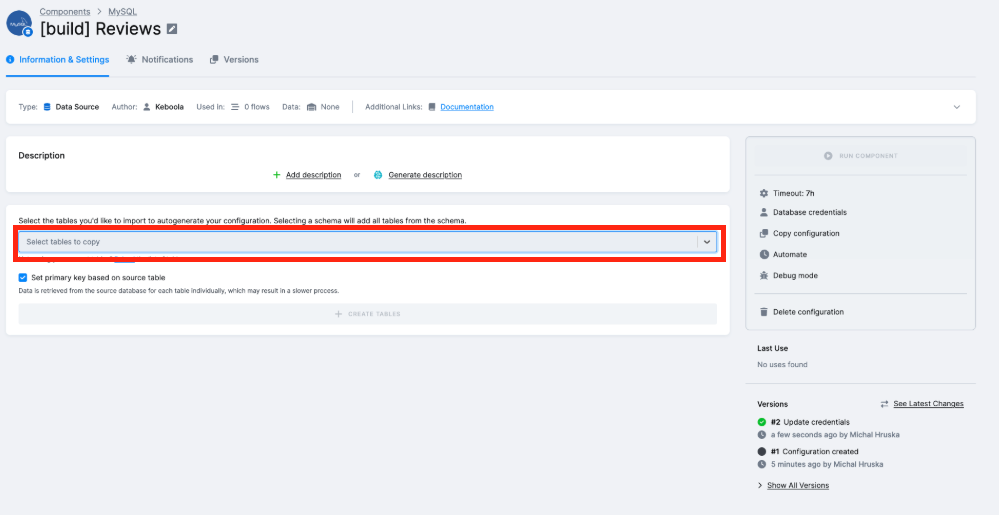

2. Click **CREATE TABLE** 
    
    - Keboola creates so called `configuration row` for each selected table. Click the row to enter the row configuration details.
        
    - In the detailed settings we can configure incremental fetching as well as loading to Keboola, primary keys or even use the “advanced mode” to enter a SQL statement instead. That statement would be executed by Keboola in the source MySQL database and the result would be processed and stored in Keboola. We’ll keep the settings default, as it is. 

3. Click **RUN** to execute the connector job to fetch the data into Keboola's backend (Snowflake).
    

    Click RUN again in the dialog popup.

    

4. We executed a **JOB**. Navigate to **Jobs** from the main menu to see a list of jobs.
    
    Click the job to enter its detail.

5. Navigate to **Storage** from the main menu.
    - The Storage UI is an explorer of the objects that are stored in the Snowflaked backend behind Keboola. 
    - After the executed Job finishes successfully we'll see a new data bucket (Snowflake Schema) there.
        - Expand the bucket  to see the tables. Then click the Table to view its details:
        
        
    - At the `Overview` tab we can see all the table's metadata. At the `Data Sample` we can study and filter the extracted data.
        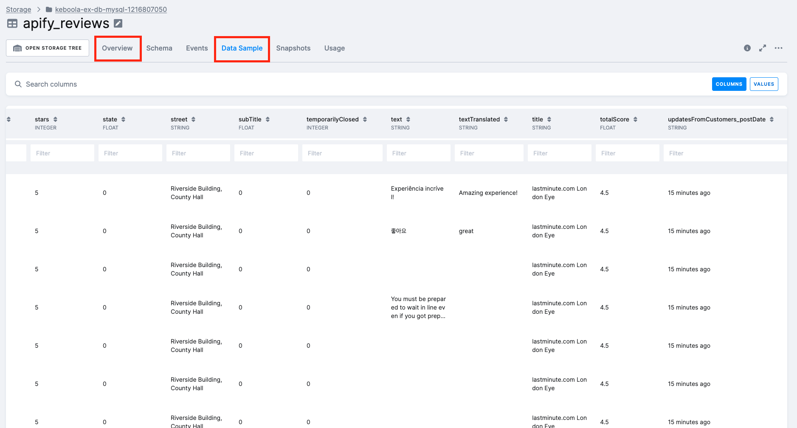

---

## Step 2: Data Transformation
We can see that some of the reviews are empty - at the moment we are not interested in those. Let’s create a SQL transformation to process and clean the extracted data.

### Create a Transformation
1. Navigate to `Transformations` > `CREATE TRANSFORMATION`.
    
2. Choose `Snowflake SQL Transformation` 

    

    Name it `[build][01] Data Cleaning` and click `CREATE TRANSFORMATION`
    

3. Add the SQL code:

    There are many things we can configure on the Transformation detail page. At the moment we’ll keep it simple. Click `Add new code`.
    
    
    Enter the following statement and click `SAVE`.

    ```sql
    CREATE OR REPLACE TABLE "aggregated_reviews" AS
    SELECT
        "url",
        "publishedAtDate",
        "stars",
        "name",
        "text",
        'Google Places' AS "reviewSource"
    FROM "apify_reviews"
    WHERE "text" IS NOT NULL AND "text" <> '' AND "text" <> 'text'
    LIMIT 500;
    ```

    


4. Configure the input and output mappings:
    - The statement reads the table named “apify_reviews” we extracted in the first step and creates a table named “aggregated_reviews”. In Keboola transformation this code is executed in a temporary Transformation schema every time the Transformation is executed. In order to propagate the query results to the main Storage we need to configure an Output Mapping. 

    - The output mapping (together with the input mapping which we’ll configure later, too) provides several functionalities users can use to define incremental processing etc. 

    Click `New Table Output`

    

    Enter `aggregated_reviews` as a Table name, keep other settings unchanged and click ADD OUTPUT
    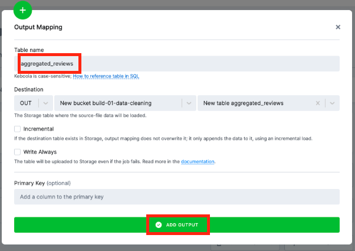

    Now, because we haven’t used an absolute path to our source table in the query (path that would include the bucket (schema) name) we need to use the Table Input Mapping, too. Click `New Table Input`, select `apify_reviews` as a source and click **ADD INPUT**.
    

5. Run the transformation.

    

    After the job is successfully executed you will see new table in the Storage explorer.
    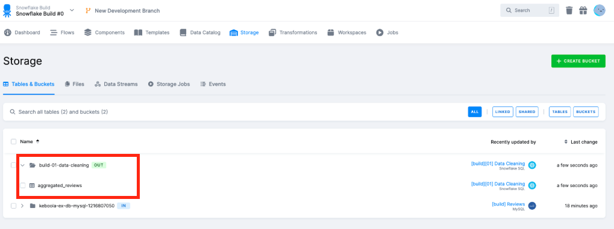

---

## Step 3: AI Enrichment
We can see that the “text” of the reviews is in varying language and format. We’ll use Keboola’s Generative AI component to translate the text and process a sentiment analysis and keyword extraction. 

### Set Up the Generative AI Component
1. Navigate to `Components` > `Components` > `ADD COMPONENT` and search for `Generative AI` and click `ADD COMPONENT` .
    
2. Enter `[build] Sentiment analysis, Keyword extraction` as a name and click `CREATE CONFIGURATION`
    

3. Configure the component:
    Click `Open Data Source Configuration settings`
    
    
    Enter the following and click `SAVE`
   - AI Service Provider: Hugging Face
   - API Key: `tbd`

    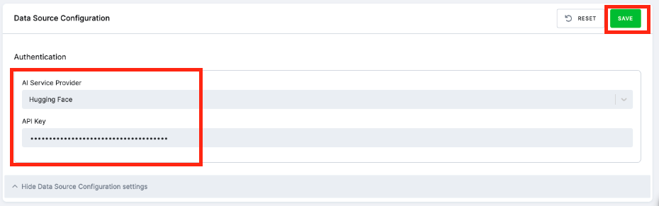

4. Add a configuration row named `Sentiment and Keywords`.
    
    Click `Add Row` to add a component configuration row.
    

    Enter `Sentiment and Keywords` as a name and click `CREATE`

    

    Now we will configure the component. Lets start with selecting the table we want to work with. Click `New Table Input` and select the `aggregated_reviews` table we created in the previous step. Click `ADD INPUT`.
    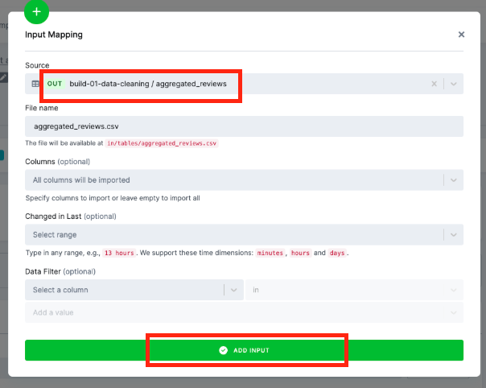


    Under `Configuration Parameters` click `LIST MODELS`. Keboola will use the previously entered API key to list all models available in the Hugging Face.
    
    Select `Custom Model` and enter the following:
   - Model Endpoint: `https://pnf9wg1qophxwyrh.us-east-1.aws.endpoints.huggingface.cloud`
   - Enter 500 to `Max Tokens`, keep other parameters unchanged.
    
    

#### Configure the Prompt
Scroll down to Prompt Options. In here we enter a prompt which Keboola will call with content from the Input Table. It will be called for every single row from the input table. Use this prompt:
```
Process the below text in 3 ways: 1) If it is not in English, translate it 2) Extract any key words or phrases from the text (maximum 5) 3) Score the sentiment of the translated text on a scale of -1.00 (very negative) to 1.00 (very positive). For example, 'I love this!' should be close to 1.00 and 'I hate this.' should be close to -1.00. Ensure the score accurately reflects the sentiment. Give me response in JSON using the following structure: {"text_in_english": text in english, "keywords": [keywords], "sentiment": calculated score}. Return the JSON only, do not append with the word "json".

Text: """
[[text]] 
"""
```

Notice the `[[text]]` placeholder - it tells Keboola that it needs to replace this placeholder with a value of `text` column from the input table. 

We can click `TEST PROMPT` to see what the model would return for first couple of rows from our Input Table.


If we are happy with the results we’ll enter `processed_reviews` as a `Destination Storage Table Name`, scroll up and click `SAVE` and then `RUN COMPONENT` to exectue the component job. 


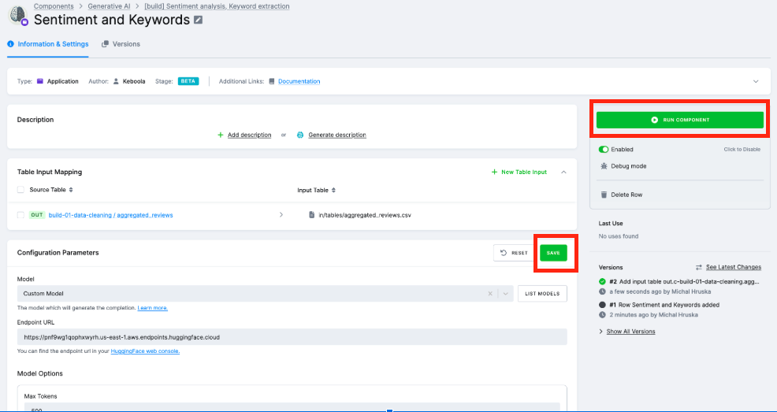

Keboola will use the selected input table and process each row with the entered prompt using the Hugging Face model. 

It will store the results into a Storage table named processed_reviews which we’ll find in Storage after the Job is successfully executed. This job might take around 10 minutes to complete.

## Step 4: Process LLM response
Navigating to `Storage` we can view the data sample of our new `processed_reviews` table. 


We can see the `result_value` is formatted as `Prompt text: {response json}`. We need to parse the individual values from that response json. We'll use Python transformation for that.

### Create a Python Transformation
1. Navigate to `Transformations`, click `CREATE TRANSFORMATION` and select `Python Transformation`
    

2. Enter `[build][02] Processed reviews parsing` as a name and click `CREATE TRANSFORMATION`
    

3. Click `New Table Input` to add the `processed_reviews` table to the input mapping. 

    

    

4. Scroll down and click `Add New Code`

    

5. Add the following code and click `SAVE`
    ```python
    import pandas as pd
    import json
    import re
    from datetime import datetime

    # Input file paths
    INPUT_FILE = 'in/tables/processed_reviews.csv'
    OUTPUT_FILE_PARSED = 'out/tables/reviews_parsed.csv'
    OUTPUT_FILE_KEYWORDS = 'out/tables/keyword_counts.csv'

    # Load the data
    data = pd.read_csv(INPUT_FILE)

    # Function to extract JSON from the "result_value" column
    def extract_json_from_text(row):
        try:
            # Remove the static prompt
            cleaned_row = re.sub(
                r'^Process the below text in 3 ways:.*?Return the JSON only, do not append with the word "json".', 
                '', 
                row, 
                flags=re.DOTALL
            ).strip()
            
            # Extract the JSON block using regex
            json_match = re.search(r'\{.*\}', cleaned_row, re.DOTALL)
            if json_match:
                return json.loads(json_match.group())  # Parse JSON into a dictionary
            return None
        except json.JSONDecodeError as e:
            print(f"JSONDecodeError: {e} in row: {row}")
            return None

    # Function to convert ISO 8601 date to 'YYYY-MM-DD'
    def convert_date(date_str):
        try:
            dt = datetime.strptime(date_str, '%Y-%m-%dT%H:%M:%S.%fZ')
            return dt.strftime('%Y-%m-%d')
        except ValueError:
            return None  # Return None if the date parsing fails

    # Function to categorize sentiment based on score
    def categorize_sentiment(score):
        if score < -0.2:
            return 'Negative'
        elif -0.2 <= score <= 0.2:
            return 'Neutral'
        else:
            return 'Positive'

    # Extract JSON from the "result_value" column
    data['parsed_json'] = data['result_value'].apply(extract_json_from_text)

    # Extract individual fields from the parsed JSON
    data['text_in_english'] = data['parsed_json'].apply(lambda x: x.get('text_in_english') if x else None)
    data['parsed_date'] = data['publishedAtDate'].apply(convert_date)
    data['keywords'] = data['parsed_json'].apply(lambda x: ', '.join(x.get('keywords', [])) if x else None)
    data['sentiment'] = data['parsed_json'].apply(lambda x: x.get('sentiment') if x else None)

    # Ensure sentiment is numeric, handle NaN, and round to 1 decimal place
    data['sentiment'] = pd.to_numeric(data['sentiment'], errors='coerce')
    data['sentiment'] = data['sentiment'].round(1)

    # Categorize sentiment into 'Positive', 'Neutral', 'Negative'
    data['sentiment_category'] = data['sentiment'].apply(categorize_sentiment)

    # Remove rows where parsing failed (e.g., missing sentiment)
    data = data.dropna(subset=['sentiment'])

    # Process keywords: explode into individual rows
    df_keywords = data.copy()
    df_keywords['keywords'] = df_keywords['keywords'].str.split(', ')
    df_exploded = df_keywords.explode('keywords')

    # Aggregate keyword counts by sentiment, keyword, and parsed date
    keyword_counts = (
        df_exploded.groupby(['sentiment', 'keywords', 'parsed_date'])
        .size()
        .reset_index(name='counts')
    )

    # Save the processed data and keyword counts
    data.to_csv(OUTPUT_FILE_PARSED, index=False)
    keyword_counts.to_csv(OUTPUT_FILE_KEYWORDS, index=False)

    print(f"Parsed reviews saved to: {OUTPUT_FILE_PARSED}")
    print(f"Keyword counts saved to: {OUTPUT_FILE_KEYWORDS}")
    ```

    
        
6. Configure **OUTPUT MAPPING**

    The script reads the input table as a CSV file. It also creates two new CSV files - one with parsed sentiment of the review and another one which aggregates counts of each keyword. We need to configure the `output mapping` to make sure the tables are loaded to `Storage` when the Transformation is executed.

    Click `New Table Output`, enter `reviews_parsed.csv` as a **File name**. This is how we named it in our Transformation Code. 
    
    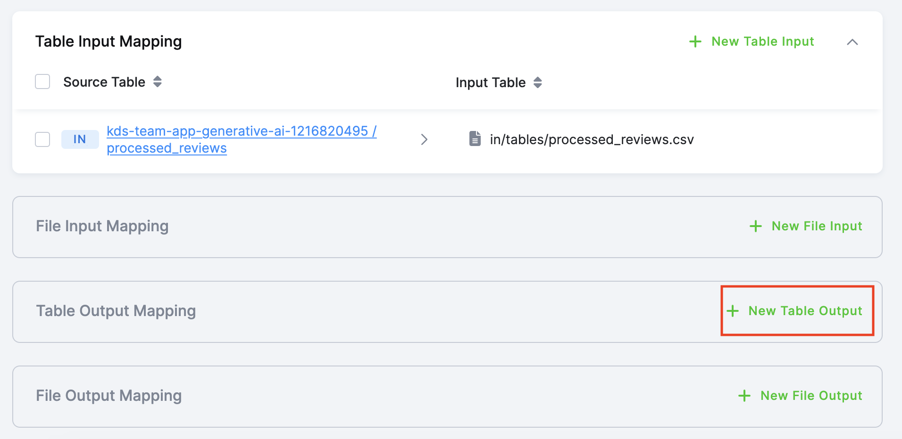

    Click `ADD OUTPUT`

    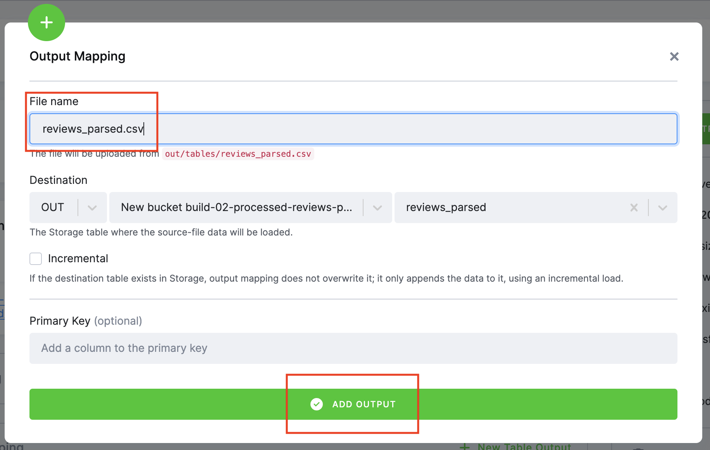

    Repeat the same for **file name** `keyword_counts.csv`. The Table Output Mapping should now look like this:

    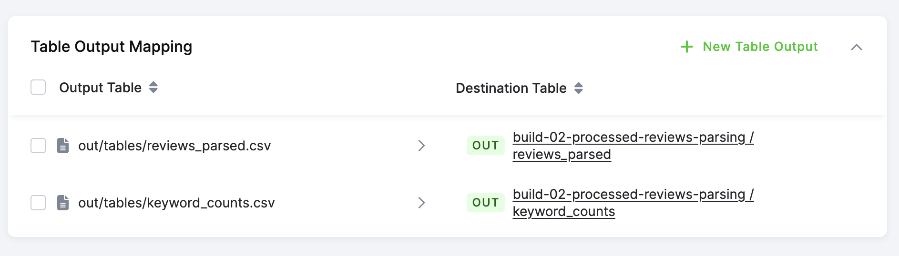

7. Click **Run Transformation** to execute the job    

    

    After the Job finishes successfully we'll see two new tables in our Storage.

    

    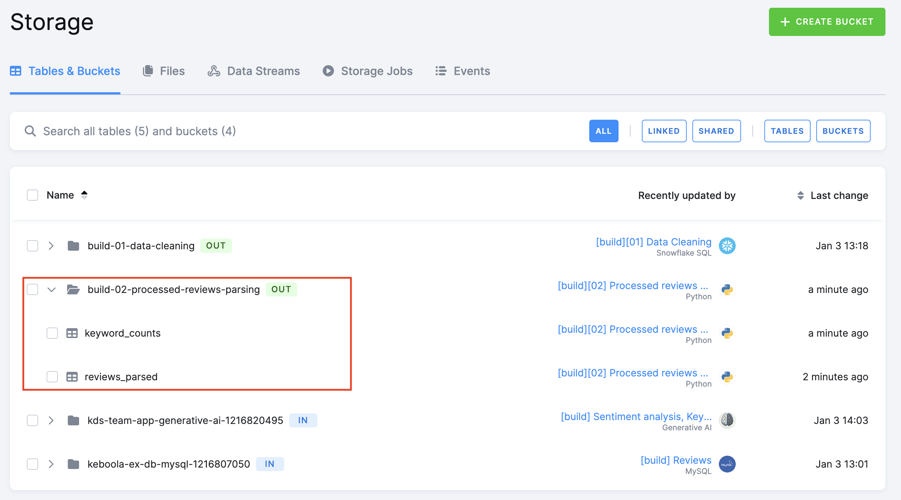

